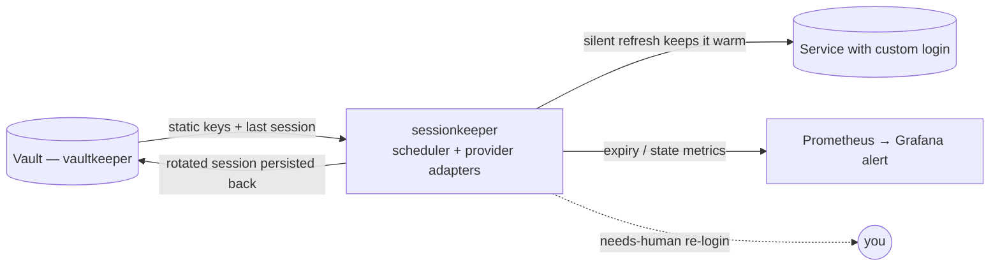

# sessionkeeper

> Keeps long-lived sessions **warm** for services whose login is a custom,
> non-standard auth flow — by running a provider-specific token refresh on a
> timer, persisting the rotated credentials back to your vault, and alerting you
> only when a real human re-login is actually required.

[](LICENSE)

> **Status:** design / scaffolding. The architecture and contracts below are
> settled; the implementation lands in subsequent versions.

## In plain terms

Some online services don't use the tidy "Sign in with…" standard (OAuth) that
off-the-shelf tools know how to manage. Instead they hand your app a pair of
short-lived passes — one that expires in an hour, one that lasts a few days — and
expect the app to keep quietly trading the old passes for new ones before they
run out. If nothing does that trading, you get logged out and have to sign in by
hand again (often through an annoying "prove you're human" check).

**sessionkeeper is the little robot that does the trading for you.** It wakes up
every so often, swaps the about-to-expire passes for fresh ones, and tucks the
new ones safely back in your vault. You only hear from it when the passes have
fully lapsed and it genuinely needs *you* to sign in once — and even then it just
sends a heads-up and points you to where to do it.

The result: services with fiddly custom logins stay logged in on their own, for
as long as the provider allows, with no babysitting from you.

## Why

Standard credential managers (e.g. OAuth brokers) handle OAuth2/OIDC providers
out of the box. They do **not** handle services with **proprietary auth**:
bespoke cookie/token pairs, custom `/refresh` endpoints, non-standard headers,
app-attestation keys, etc. Those sessions silently expire unless something runs
the provider's specific refresh dance on schedule.

`sessionkeeper` is the always-on home for that logic. It is **not** a vault — it
holds no secrets at rest. It is a **refresh engine**: a scheduler plus a set of
small per-provider **adapters**, each of which knows how to do three things for
one service:

| Adapter contract | Purpose |
|---|---|
| `probe(session)` | cheap read-only check: `healthy` / `stale` / `dead` |
| `refresh(session)` | run the provider's silent refresh; return rotated session (or raise `NeedsLogin`) |
| `login(creds, assist)` | full (re)login — may require human assistance (CAPTCHA / 2FA) |

The scheduler wakes before expiry, calls `refresh()`, writes the rotated session
back to the vault, and exports an expiry metric. When `refresh()` raises
`NeedsLogin`, it flips the provider to `needs-human` and fires an alert.



## Where do the rotating tokens live? (in the vault — not here)

**By design, sessionkeeper is stateless.** Rotating session material (short-lived
access tokens, longer-lived refresh tokens/cookies) is **persisted back to the
vault** via [vaultkeeper](https://github.com/dragoshont/vaultkeeper), alongside
the static keys. The loop is simply:

```
read latest session from vault → refresh → write rotated session back to vault → sleep
```

This is deliberate. An earlier design kept a separate broker-local token store;
that fragmented the "one source of truth" the vault exists to be, and added a
second thing to back up. Persisting back to the vault means:

- **Single source of truth** — every secret, static *and* rotating, in one place.
- **No PVC, clean restarts** — refresh tokens rotate (each refresh invalidates the
  previous one), so the durable copy *must* be the freshest; the vault is that
  copy. A restarted pod just re-reads the latest and continues.
- **One backup, one UI.**

Rotating items are written into a dedicated `machine-managed/` vault folder to
keep them out of your human-facing password list. The only added requirement is
that sessionkeeper has **write** access to the vault (vaultkeeper read+write),
contained by the same NetworkPolicy isolation.

## Security posture

`sessionkeeper` transiently handles live session material for potentially
sensitive accounts. Treat it as high-value:

- **Cluster-internal only** — no ingress / tunnel, no public hostname.
- **Network-isolated** — reaches the vault (vaultkeeper) and the providers'
  public APIs only; nothing reaches *it* except the metrics scraper.
- **Human-in-the-loop on sensitive actions** — any state-changing operation a
  provider exposes (not just reads) requires explicit confirmation; it is never
  performed autonomously.
- **Holds nothing at rest** — secrets come from the vault at runtime and rotated
  material goes straight back; no secret files in the image, repo, or args.
- **Re-auth never auto-defeats a human gate** — when a provider requires a real
  login (CAPTCHA, 2FA, federated consent), sessionkeeper escalates to you rather
  than attempting to script around the protection.

## Observability

Exports Prometheus metrics so your existing Grafana/alerting answers
"what needs my attention?":

| Metric | Meaning |
|---|---|
| `sessionkeeper_session_state{provider}` | `0` healthy / `1` stale / `2` dead / `3` needs-human |
| `sessionkeeper_session_expiry_seconds{provider}` | seconds until the current session expires |
| `sessionkeeper_refresh_total{provider,result}` | refresh attempts by outcome |

A single alert rule ("provider X needs re-login" / "session expiring < N h")
routes through your existing contact point.

## Adding a provider

Each service is one adapter implementing the `probe` / `refresh` / `login`
contract above, plus a small config entry (vault item names, refresh cadence,
whether actions need confirmation). The scheduler, vault I/O, metrics, and
alerting are generic and shared.

## Roadmap

- v0.1 — scheduler + vault-backed session store (read/refresh/write) + one
  adapter + Prometheus metrics.
- v0.2 — `needs-human` escalation + assisted-login path (one-time interactive
  re-auth for CAPTCHA / federated logins via a persistent browser profile).
- v0.3 — multi-provider config, per-provider rate limits, MCP tool surface
  ("what needs login?").

## License

[MIT](LICENSE).
