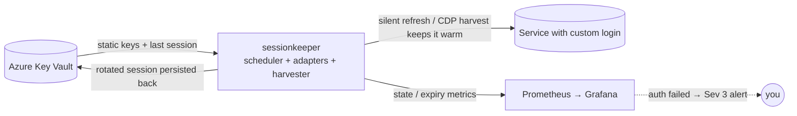
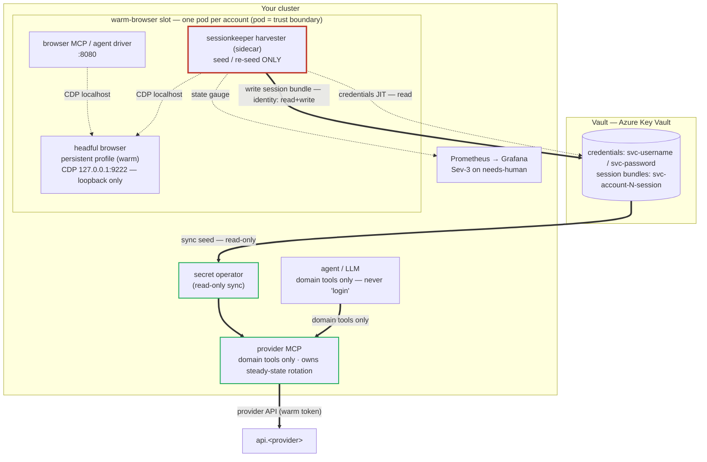

# sessionkeeper

> Keeps long-lived sessions **warm** for services whose login is a custom,
> non-standard auth flow — by running a provider-specific token refresh on a
> timer, persisting the rotated credentials back to your vault, and alerting you
> only when a real human re-login is actually required.

[](LICENSE)

> **Status:** v0.3 — the refresh engine, recipe **dependency DAG**, the
> **Azure Key Vault** backend (Service-Principal *or* Workload-Identity auth),
> the per-provider **circuit breaker**, and the autonomous **harvester** —
> now including an **automated cold-login form-drive** (it logs in *for* you in a
> warm headful browser over CDP; **no manual login**) — all ship and are
> unit-tested offline (90 tests, stdlib-only runtime). What remains is per-account
> recipes + arming the login selectors at deploy time; real targets live in a
> private overlay, never in this public repo.

## In plain terms

Some online services don't use the tidy "Sign in with…" standard (OAuth) that
off-the-shelf tools know how to manage. Instead they hand your app a pair of
short-lived passes — one that expires in an hour, one that lasts a few days — and
expect the app to keep quietly trading the old passes for new ones before they
run out. If nothing does that trading, you get logged out and have to sign in by
hand again (often through an annoying "prove you're human" check).

**sessionkeeper is the little robot that does the trading for you.** It wakes up
every so often, swaps the about-to-expire passes for fresh ones, and tucks the
new ones safely back in your vault. You only hear from it when the passes have
fully lapsed and it genuinely needs *you* to sign in once — and even then it just
sends a heads-up and points you to where to do it.

The result: services with fiddly custom logins stay logged in on their own, for
as long as the provider allows, with no babysitting from you.

## Why

Standard credential managers (e.g. OAuth brokers) handle OAuth2/OIDC providers
out of the box. They do **not** handle services with **proprietary auth**:
bespoke cookie/token pairs, custom `/refresh` endpoints, non-standard headers,
app-attestation keys, etc. Those sessions silently expire unless something runs
the provider's specific refresh dance on schedule.

`sessionkeeper` is the always-on home for that logic. It is **not** a vault — it
holds no secrets at rest. It is a **refresh engine**: a scheduler plus a set of
small per-provider **adapters**, each of which knows how to do three things for
one service:

| Adapter contract | Purpose |
|---|---|
| `probe(session)` | cheap read-only check: `healthy` / `stale` / `dead` |
| `refresh(session)` | run the provider's silent refresh; return rotated session (or raise `NeedsLogin`) |
| `login(assist)` | autonomous (re)login via the harvester (warm browser → CDP cookie harvest); raises `NeedsLogin` only on a genuine dead-end |

The scheduler wakes before expiry, calls `refresh()`, writes the rotated session
back to the vault, and exports an expiry metric. When `refresh()` raises
`NeedsLogin`, it **escalates to the harvester's `login()`** — guarded by a
single-flight lock + a per-provider **circuit breaker** (`min_seconds_between_logins`,
`max_logins_per_day`) so a relogin storm can't escalate reCAPTCHA / flag the
account. Only when that *also* fails (or the breaker is open) does the provider
flip to `needs-human` and fire a **Sev-3** alert.



## Architecture

Stdlib-only runtime (the serving/HTTP, CDP WebSocket, and KV REST clients are all
hand-rolled on `urllib`/sockets); every transport is injectable, so the whole
surface is unit-tested **offline** with no browser, no Azure, no network.

The broker has **two arms, split by cost**:

- **Cheap & frequent (no browser):** the provider's own silent refresh keeps the
  session warm — ~99% of keep-alive. For a token-pair service this is a config-only
  `http_refresh` adapter; for a cookie service the consuming app refreshes itself.
- **Expensive & rare (in-pod browser):** the **harvester** drives a *warm* headful
  browser over CDP to log in automatically (credentials pulled just-in-time from
  the vault) and harvest the session — only on a cold start or after a refresh
  chain fully lapses. A relogin storm is bounded by a single-flight lock + circuit
  breaker; a genuine dead-end raises a Sev-3 alert (never a silent wrong-state).

### Components & boundaries



CDP is **loopback-only** (Chrome binds `127.0.0.1:9222`), so the harvester runs
*in the browser pod* as a sidecar — it never exposes the debugger off-pod. The
**write** identity (harvester, red) is separate from the **read-only** path (the
secret operator + the consuming MCP, green): least privilege by construction.

### How a session lives

```mermaid
sequenceDiagram
    participant H as Harvester (sidecar)
    participant B as Headful browser
    participant V as Vault
    participant M as Provider MCP
    participant P as Provider API
    Note over H,B: seed / re-seed — RARE, browser
    H->>V: read username/password (JIT)
    H->>B: navigate + fill form + submit (CDP)
    B-->>H: logged in → cookies (some httpOnly)
    H->>V: write session bundle
    Note over V,M: delivery — read-only sync
    V->>M: seed → access / refresh token
    Note over M,P: keep-warm — FREQUENT, no browser
    loop before expiry / on 401
        M->>P: request (warm token)
        P-->>M: rotated token (in-memory)
    end
    Note over H,M: single rotation owner = the consumer → no race
    Note over H: refresh chain fully dead → re-seed; else Sev-3 alert
```

**One rotation owner.** Whichever component refreshes the live token chain owns
it alone — the harvester only *seeds/re-seeds*, never competes with the
consumer's steady-state rotation, so the two can't invalidate each other.

## Where do the rotating tokens live? (in the vault — not here)

**By design, sessionkeeper is stateless.** Rotating session material (short-lived
access tokens, longer-lived refresh tokens/cookies) is **persisted back to Azure
Key Vault**, alongside the static keys. The loop is simply:

```
read latest session from KV → refresh / harvest → write rotated session back to KV → sleep
```

This is deliberate. An earlier design kept a separate broker-local token store;
that fragmented the "one source of truth" the vault exists to be, and added a
second thing to back up. Persisting back to the vault means:

- **Single source of truth** — every secret, static *and* rotating, in one place.
- **No PVC, clean restarts** — refresh tokens rotate (each refresh invalidates the
  previous one), so the durable copy *must* be the freshest; the vault is that
  copy. A restarted pod just re-reads the latest and continues.
- **One backup, one UI.**

**Read vs. write paths.** The [External Secrets Operator](https://external-secrets.io)
syncs KV→cluster Secrets one-way for the *consumers* (the per-provider MCPs read
the seeded creds from a mounted Secret, read-only). sessionkeeper is the
**rotation owner**, so it reads and **writes rotated bundles back to KV directly**
over the KV REST API, authenticated by **Azure Workload Identity** (a federated
ServiceAccount token exchanged for an AAD token — no static client secret on
disk). That identity needs `Key Vault Secrets Officer`; the consumers' ESO
identity stays `Secrets User` (read-only). All of it is contained by the same
NetworkPolicy isolation.

> A legacy `vaultkeeper` (Bitwarden `bw serve`) backend is still selectable via
> `SESSIONKEEPER_VAULT_BACKEND=vaultkeeper`, but **Azure KV is the default and
> the documented path**.

## Security posture

`sessionkeeper` transiently handles live session material for potentially
sensitive accounts. Treat it as high-value:

- **Cluster-internal only** — no ingress / tunnel, no public hostname.
- **Network-isolated** — reaches the vault (Azure KV) and the providers'
  public APIs only; nothing reaches *it* except the metrics scraper.
- **Fully unattended re-auth** — refresh and relogin run autonomously; there is
  **no** per-login Approve/Deny gate and no notification app. The only human
  signal is a **Sev-3 alert** when auth genuinely fails (see Observability).
- **Holds nothing at rest** — secrets come from the vault at runtime and rotated
  material goes straight back; no secret files in the image, repo, or args.
- **Login is never an agent tool** — consuming MCPs expose domain tools only; no
  `login`/`harvest`/`reauth` is ever callable by an LLM, so a prompt-injected
  page can't trigger a login storm. Auth is ambient infrastructure.
- **Never scripts around a human gate** — when a provider genuinely requires an
  interactive step (CAPTCHA, 2FA, federated consent) that unattended login can't
  pass, the session goes `needs-human` and you do the one-time login; the system
  never tries to defeat the protection.

## Observability

Exports Prometheus metrics so your existing Grafana/alerting answers
"what needs my attention?":

| Metric | Meaning |
|---|---|
| `sessionkeeper_session_state{provider}` | `0` healthy / `1` stale / `2` dead / `3` needs-human |
| `sessionkeeper_session_expiry_seconds{provider}` | seconds until the current session expires |
| `sessionkeeper_refresh_total{provider,result}` | refresh attempts by outcome |
| `sessionkeeper_login_total{provider,result}` | escalated (harvester) logins by outcome |

The **only** alert that needs a human is Sev-3 "provider X needs a one-time
login", expressed on the state gauge and routed through your existing contact
point (optionally mirrored to Azure Monitor / IcM):

```yaml
- alert: SessionkeeperNeedsHuman
  expr: 'max by (provider) (sessionkeeper_session_state) == 3'
  for: 5m
  labels: { severity: sev3, pipeline: auth-broker }
```

## Consumer contract (for the per-provider MCPs)

The whole point is that consumers **work without knowing the struggles behind
auth**:

- A consuming MCP calls only **domain tools** (`rm_search_slots`, …). It never
  sees a password, a token, or a login flow.
- When a session is genuinely unavailable, a domain tool returns a clean
  `session_unavailable` error and **does not block** on a browser login.
- The system runs **unattended**; the only human touch is acting on the Sev-3
  alert above. There is no Approve/Deny prompt to answer.

## Onboarding a new provider recipe

A *recipe* teaches the broker how to keep one service warm. The login is
**fully automated — there is no manual human login step**: when a session is
cold, the harvester drives the *warm headful browser* over CDP and logs in
itself, using credentials pulled just-in-time from the vault. A human is only
ever paged (Sev-3) if that automated login genuinely can't complete.

> **Where recipes live.** The public repo ships only *generic* example recipes
> (`config/providers.example.json`). **Real recipes — real domains, account
> bindings, and especially any health provider — live in a PRIVATE overlay**, never
> in the public repo (see [SECURITY.md](SECURITY.md) and the spec §17). The
> homelab deploy mounts the real `providers.json` from a private source.

> **Operator guide:** [docs/operating.md](docs/operating.md) covers vault auth
> (Service Principal vs Workload Identity), the in-pod harvester sidecar, rotation
> ownership, and a scripted, idempotent bootstrap pattern.

### 1. Prerequisites (per provider)

| Prereq | What / why |
|---|---|
| **Warm headful browser** | A persistent-profile Chromium pod with CDP on `127.0.0.1:9222`, reachable in-pod (loopback only, never exposed). One profile **per account** so sessions stay isolated. reCAPTCHA does not challenge a reputable warm profile — this is why login runs there, never in a cold/fresh profile. |
| **Credentials in the vault** | The login username + password stored as Azure Key Vault secrets; the recipe references them by name (`username_ref` / `password_ref`). The harvester reads them at login time and **never persists or logs** them. |
| **Vault identity for the harvester** | An AAD identity with `Key Vault Secrets Officer` (read the credentials **and** write back the rotated session bundle). Use a **Service Principal** client secret on clusters without a public OIDC issuer (e.g. MicroK8s), or **Workload Identity** on managed clusters — the engine auto-selects (see [docs/operating.md](docs/operating.md)). Consumers get `Secrets User` (read-only). |
| **NetworkPolicy** | Broker egress to CDP (localhost, same pod) + vault (`:443`) + metrics. **No ingress** except the metrics scraper. |
| **Dependencies first** | If this provider logs in *through another* (e.g. "Sign in with Google"), the **identity recipe must exist first**. The recipe DAG (`depends_on`) keeps the identity node warm before its dependents and **rejects cycles / dangling deps at load** — author them in dependency order. |

### 2. Author the recipe (reference-only; no secrets in the file)

Add an entry to the (private) `providers.json`. Two shapes:

**Self-contained login (e.g. a portal with its own form):**

```jsonc
{
  "id": "acme-account-a",
  "vault_item": "acme-account-a-session",   // KV secret the bundle is written to
  "ttl_hint_seconds": 3600,
  "min_seconds_between_logins": 300,          // circuit breaker
  "max_logins_per_day": 24,
  "settings": {
    "strategy": "browser_cookie_harvest",
    "cdp_url": "http://127.0.0.1:9222",
    "profile": "warm-profile-a",
    "domains": ["acme.example"],
    "success_when": { "cookie": "SessionToken" },   // asserted on every harvest
    "access_cookie_name": "SessionToken",
    "refresh_cookie_name": "RefreshToken",
    "login": {                                  // <- enables AUTOMATED login
      "url": "https://acme.example/login",
      "username_ref": "acme-a-username",        // KV secret names (values never here)
      "password_ref": "acme-a-password",
      "username_selector": "#email",
      "password_selector": "#password",
      "submit_selector": "button[type=submit]",
      "settle_seconds": 1.0,
      "timeout_seconds": 30.0
    }
  }
}
```

**Dependent login (rides an identity provider):** add the identity recipe, then
point the dependent at it with `"depends_on": ["google"]` and the appropriate
strategy (`oauth_google` / `browser_token_harvest`). The identity recipe is kept
warm first so one re-login heals all dependents.

If a recipe omits the `login` block, login stays *warm-harvest only* — it can
harvest an already-authenticated profile but won't drive a form; a logged-out
profile then pages Sev-3. Provide the `login` block to get hands-off re-login.

### 3. Activate

1. Put the credentials in Key Vault (`username_ref` / `password_ref`).
2. Commit the recipe to the private overlay; reconcile so the broker mounts it.
3. On the next tick the keeper sees a cold session → `refresh()` raises
   `NeedsLogin` → **escalates to `login()`** → the harvester navigates the warm
   browser, fills the creds, submits, waits for `success_when`, harvests the
   cookies, and writes the bundle to KV. State → `healthy`. All automatic.
4. **Verify:** `sessionkeeper_session_state{provider="acme-account-a"} == 0`
   (healthy) and the KV secret `acme-account-a-session` now holds a bundle.
5. Deploy the consuming MCP pointed at that KV session secret. It calls domain
   tools only and never touches auth (see the consumer contract above).

### 4. Strategy cheat-sheet

| `strategy` | Use for | Login mechanism |
|---|---|---|
| `browser_cookie_harvest` | portals whose session is cookies (some httpOnly), e.g. Regina Maria | automated form-drive in the warm browser + CDP `Storage.getCookies` |
| `http_refresh` | services with an access+refresh token pair and a `/refresh` endpoint | config-driven silent refresh (no browser) |
| `oauth_google` / `browser_token_harvest` | social-login / SPA bearer tokens (e.g. OLX via Google) | depends on an identity recipe; *(roadmap)* |

### Troubleshooting

- **`needs_human` Sev-3 alert** → the automated login couldn't satisfy
  `success_when` (provider prompted MFA/CAPTCHA, or selectors drifted). Check the
  selectors against the live page; confirm the warm profile's egress is
  residential; do not try to defeat a real human gate (spec non-goal).
- **Target/up `0` in Prometheus** → default ns is default-deny ingress; the app
  needs an `allow-<app>-ingress` NetworkPolicy from observability/prometheus.
- **Login storms / CAPTCHA escalation** → that's what `min_seconds_between_logins`
  + `max_logins_per_day` (the circuit breaker) prevent; never lower them to brute
  through a block.

## Roadmap

- **v0.1** ✓ — scheduler + vault-backed session store (read/refresh/write) + one
  generic adapter + Prometheus metrics.
- **v0.2** ✓ — `needs-human` escalation + autonomous **harvester** `login()`
  (warm browser → CDP cookie harvest), recipe **dependency DAG**, per-provider
  **circuit breaker**, **Azure Key Vault** backend (workload identity).
- **v0.3** ✓ — **automated cold-login form-drive** (no manual login: the harvester
  navigates the warm headful browser and signs in with vault credentials over
  CDP) + JIT credential pull from the vault.
- v0.4 — `browser_token_harvest` (JS-storage bearer tokens, OLX) +
  `oauth_google` dependent logins + the MCP status surface.

## License

[MIT](LICENSE).
