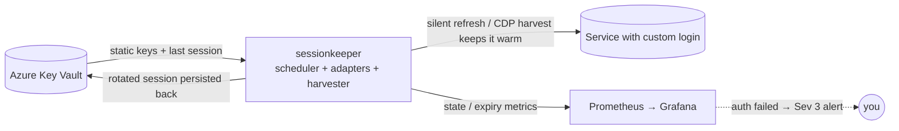

# sessionkeeper

> Keeps long-lived sessions **warm** for services whose login is a custom,
> non-standard auth flow — by running a provider-specific token refresh on a
> timer, persisting the rotated credentials back to your vault, and alerting you
> only when a real human re-login is actually required.

[](LICENSE)

> **Status:** v0.2 — the refresh engine, the recipe **dependency DAG**, the
> **Azure Key Vault** backend, the per-provider **circuit breaker**, and the
> autonomous browser-cookie **harvester** (CDP) all ship and are unit-tested
> (offline, no network). What remains is per-account recipes + a one-time
> credential seed at deploy time; real targets live in a private overlay, never
> in this public repo.

## In plain terms

Some online services don't use the tidy "Sign in with…" standard (OAuth) that
off-the-shelf tools know how to manage. Instead they hand your app a pair of
short-lived passes — one that expires in an hour, one that lasts a few days — and
expect the app to keep quietly trading the old passes for new ones before they
run out. If nothing does that trading, you get logged out and have to sign in by
hand again (often through an annoying "prove you're human" check).

**sessionkeeper is the little robot that does the trading for you.** It wakes up
every so often, swaps the about-to-expire passes for fresh ones, and tucks the
new ones safely back in your vault. You only hear from it when the passes have
fully lapsed and it genuinely needs *you* to sign in once — and even then it just
sends a heads-up and points you to where to do it.

The result: services with fiddly custom logins stay logged in on their own, for
as long as the provider allows, with no babysitting from you.

## Why

Standard credential managers (e.g. OAuth brokers) handle OAuth2/OIDC providers
out of the box. They do **not** handle services with **proprietary auth**:
bespoke cookie/token pairs, custom `/refresh` endpoints, non-standard headers,
app-attestation keys, etc. Those sessions silently expire unless something runs
the provider's specific refresh dance on schedule.

`sessionkeeper` is the always-on home for that logic. It is **not** a vault — it
holds no secrets at rest. It is a **refresh engine**: a scheduler plus a set of
small per-provider **adapters**, each of which knows how to do three things for
one service:

| Adapter contract | Purpose |
|---|---|
| `probe(session)` | cheap read-only check: `healthy` / `stale` / `dead` |
| `refresh(session)` | run the provider's silent refresh; return rotated session (or raise `NeedsLogin`) |
| `login(assist)` | autonomous (re)login via the harvester (warm browser → CDP cookie harvest); raises `NeedsLogin` only on a genuine dead-end |

The scheduler wakes before expiry, calls `refresh()`, writes the rotated session
back to the vault, and exports an expiry metric. When `refresh()` raises
`NeedsLogin`, it **escalates to the harvester's `login()`** — guarded by a
single-flight lock + a per-provider **circuit breaker** (`min_seconds_between_logins`,
`max_logins_per_day`) so a relogin storm can't escalate reCAPTCHA / flag the
account. Only when that *also* fails (or the breaker is open) does the provider
flip to `needs-human` and fire a **Sev-3** alert.



## Where do the rotating tokens live? (in the vault — not here)

**By design, sessionkeeper is stateless.** Rotating session material (short-lived
access tokens, longer-lived refresh tokens/cookies) is **persisted back to Azure
Key Vault**, alongside the static keys. The loop is simply:

```
read latest session from KV → refresh / harvest → write rotated session back to KV → sleep
```

This is deliberate. An earlier design kept a separate broker-local token store;
that fragmented the "one source of truth" the vault exists to be, and added a
second thing to back up. Persisting back to the vault means:

- **Single source of truth** — every secret, static *and* rotating, in one place.
- **No PVC, clean restarts** — refresh tokens rotate (each refresh invalidates the
  previous one), so the durable copy *must* be the freshest; the vault is that
  copy. A restarted pod just re-reads the latest and continues.
- **One backup, one UI.**

**Read vs. write paths.** The [External Secrets Operator](https://external-secrets.io)
syncs KV→cluster Secrets one-way for the *consumers* (the per-provider MCPs read
the seeded creds from a mounted Secret, read-only). sessionkeeper is the
**rotation owner**, so it reads and **writes rotated bundles back to KV directly**
over the KV REST API, authenticated by **Azure Workload Identity** (a federated
ServiceAccount token exchanged for an AAD token — no static client secret on
disk). That identity needs `Key Vault Secrets Officer`; the consumers' ESO
identity stays `Secrets User` (read-only). All of it is contained by the same
NetworkPolicy isolation.

> A legacy `vaultkeeper` (Bitwarden `bw serve`) backend is still selectable via
> `SESSIONKEEPER_VAULT_BACKEND=vaultkeeper`, but **Azure KV is the default and
> the documented path**.

## Security posture

`sessionkeeper` transiently handles live session material for potentially
sensitive accounts. Treat it as high-value:

- **Cluster-internal only** — no ingress / tunnel, no public hostname.
- **Network-isolated** — reaches the vault (Azure KV) and the providers'
  public APIs only; nothing reaches *it* except the metrics scraper.
- **Fully unattended re-auth** — refresh and relogin run autonomously; there is
  **no** per-login Approve/Deny gate and no notification app. The only human
  signal is a **Sev-3 alert** when auth genuinely fails (see Observability).
- **Holds nothing at rest** — secrets come from the vault at runtime and rotated
  material goes straight back; no secret files in the image, repo, or args.
- **Login is never an agent tool** — consuming MCPs expose domain tools only; no
  `login`/`harvest`/`reauth` is ever callable by an LLM, so a prompt-injected
  page can't trigger a login storm. Auth is ambient infrastructure.
- **Never scripts around a human gate** — when a provider genuinely requires an
  interactive step (CAPTCHA, 2FA, federated consent) that unattended login can't
  pass, the session goes `needs-human` and you do the one-time login; the system
  never tries to defeat the protection.

## Observability

Exports Prometheus metrics so your existing Grafana/alerting answers
"what needs my attention?":

| Metric | Meaning |
|---|---|
| `sessionkeeper_session_state{provider}` | `0` healthy / `1` stale / `2` dead / `3` needs-human |
| `sessionkeeper_session_expiry_seconds{provider}` | seconds until the current session expires |
| `sessionkeeper_refresh_total{provider,result}` | refresh attempts by outcome |
| `sessionkeeper_login_total{provider,result}` | escalated (harvester) logins by outcome |

The **only** alert that needs a human is Sev-3 "provider X needs a one-time
login", expressed on the state gauge and routed through your existing contact
point (optionally mirrored to Azure Monitor / IcM):

```yaml
- alert: SessionkeeperNeedsHuman
  expr: 'max by (provider) (sessionkeeper_session_state) == 3'
  for: 5m
  labels: { severity: sev3, pipeline: auth-broker }
```

## Consumer contract (for the per-provider MCPs)

The whole point is that consumers **work without knowing the struggles behind
auth**:

- A consuming MCP calls only **domain tools** (`rm_search_slots`, …). It never
  sees a password, a token, or a login flow.
- When a session is genuinely unavailable, a domain tool returns a clean
  `session_unavailable` error and **does not block** on a browser login.
- The system runs **unattended**; the only human touch is acting on the Sev-3
  alert above. There is no Approve/Deny prompt to answer.

## Adding a provider

Each service is one adapter implementing the `probe` / `refresh` / `login`
contract above, plus a small config entry (vault item names, refresh cadence,
whether actions need confirmation). The scheduler, vault I/O, metrics, and
alerting are generic and shared.

## Roadmap

- **v0.1** ✓ — scheduler + vault-backed session store (read/refresh/write) + one
  generic adapter + Prometheus metrics.
- **v0.2** ✓ — `needs-human` escalation + autonomous **harvester** `login()`
  (warm browser → CDP cookie harvest), recipe **dependency DAG**, per-provider
  **circuit breaker**, **Azure Key Vault** backend (workload identity).
- v0.3 — assisted **cold-login** form-drive (the `login()` extension point),
  `browser_token_harvest` (JS-storage bearer tokens), and the MCP status surface.

## License

[MIT](LICENSE).
