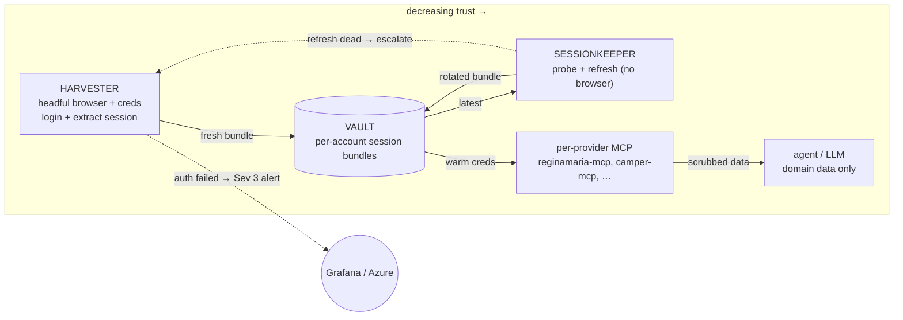
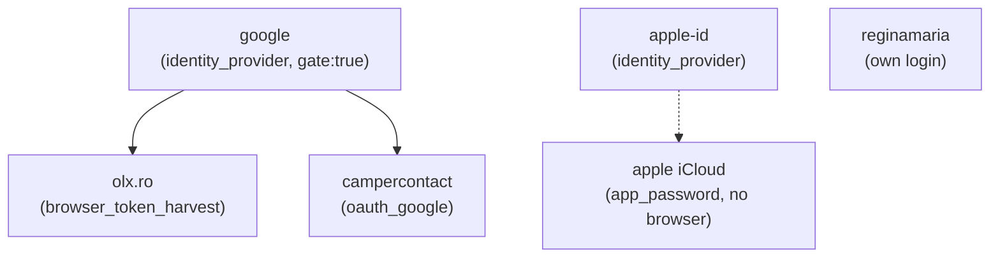
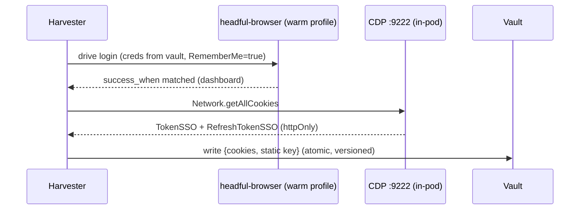
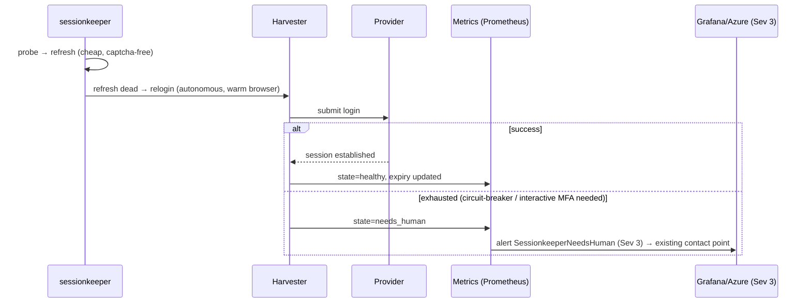

# Harvester — specification

> Status: **DRAFT spec** (2026-06-11). Companion to
> [sessionkeeper](../README.md). Defines the browser-based **session
> acquirer** that turns a warm, human-trusted browser session into reusable
> API credentials, for many providers, safely and seamlessly.

## 1. Purpose

`sessionkeeper` keeps sessions warm with cheap, headless, captcha-free
**refresh** calls. It cannot perform a **cold login** when a refresh token
finally dies — a cold login may face reCAPTCHA, a consent screen, or MFA.

The **harvester** is the component that performs that cold login and **extracts
the resulting session**, then writes it back to the vault so the API clients
(the per-provider MCPs) become "always ready."

It is a **session acquirer** with **pluggable acquisition mechanisms** — the
primary is a **real (headful) browser with a warm, reputable profile** (for
reCAPTCHA-/consent-gated portals), but it also supports **non-browser
mechanisms** where a provider's cold login is cryptographic rather than a web
form. The first non-browser mechanism is **Apple GrandSlam** (SRP-6a via
`libgsa` + the anisette device-fingerprint server) — see §4.4. What unifies them
is the *role*: acquire a session the keeper can then keep warm; the *mechanism*
is per-recipe.

It is the concrete implementation of sessionkeeper's `Provider.login()` —
currently a `NeedsLogin` stub.

### Non-goals
- Not a vault (it writes *through* to the vault; holds nothing at rest).
- Not a refresher (sessionkeeper owns the warm-keeping loop).
- Not an API client (the per-provider MCPs consume the harvested session).
- Not a captcha *solver* — for browser mechanisms it relies on a warm profile
  passing **invisible** reCAPTCHA, and escalates to a human for any **hard**
  challenge or MFA.
- Not a 2FA *bypass* — where a provider forces MFA (notably Apple GrandSlam), the
  harvester does not try to defeat it; if interactive MFA blocks an unattended
  login, the session is flagged `needs_human` and surfaces as a Sev-3 alert (§6).

## 2. Where it fits — the four roles



- **Harvester** is the only component that touches a password / drives a browser.
- It runs **rarely** (escalation only); sessionkeeper runs constantly.
- **Fully unattended** — no human-in-the-loop; the only human signal is a Sev-3
  alert when auth genuinely fails (§6).
- It is **multi-provider** by design — one engine, a registry of provider
  *recipes*.

## 2.1 Best-practice alignment (prior art — checked 2026-06-11)

The decision to **decouple credential acquisition/handling out of the API
clients (MCPs) into a separate, internal, non-exposed service** is not bespoke —
it is the well-established industry pattern. Three independent references
confirm it:

| Reference | What it establishes | How this design maps |
|---|---|---|
| **CyberArk Secretless Broker** | A broker "relieves client applications of the need to directly handle secrets." Benefits cited verbatim: *"The client is not part of the threat surface"*, *"doesn't have to know how to properly manage secrets"*, *"doesn't have to manage secret rotation."* | The MCP is the "client"; the harvester+keeper+vault are the broker tier. The agent never handles auth. **Exact match.** |
| **Azure Architecture — Sidecar pattern** | Move cross-cutting concerns (incl. auth) into a separate process/container: *"reduce the attack surface to only the necessary code"*, language-independent, **update independently**, separate lifecycle. | Harvester/keeper are separate, independently-deployed components with their own lifecycle, isolated from each MCP. |
| **SPIFFE / SPIRE** | A dedicated authority issues short-lived identity to workloads via a Workload API; apps don't hold long-lived secrets and don't run the auth handshake themselves. | sessionkeeper keeps sessions short-lived/rotated; MCPs receive warm creds, never perform the cold login. |

**Verdict:** the pattern is correct and named (token/credential **broker** +
**sidecar/separate-service** + **secretless client**). Keeping login out of the
agent surface (§9) is the security-critical corollary.

**One conscious refinement vs. the strictest form.** Secretless's *strongest*
variant is a **connection proxy**: the app's traffic flows *through* the broker,
so the app **never even receives** the credential. This design instead uses
**credential injection** — the vault hands the warm session to the MCP, which
then calls the upstream API directly (so the MCP **does** hold the token in
memory for the call). That is still squarely within best practice (it's how
Vault Agent / ESO injection works), and it's the pragmatic choice here because
each upstream is a *different bespoke API* (RM cookies, OLX bearer, CalDAV) — a
generic proxy would have to re-implement every provider's protocol. The residual
risk (token in MCP memory) is bounded by: scrub-on-error (no leak to the LLM),
per-provider isolation (one MCP compromise ≠ all), and short-lived rotated
sessions. If a provider ever warrants it, that provider can graduate to the
proxy form without changing the broker tier.

## 3. Core abstraction — the provider recipe

A provider is a declarative **recipe** (one YAML file per domain) + an **auth
strategy**. Adding a provider is ideally config, not code. The harvester ships a
small set of reusable **strategies**; a recipe picks one and supplies
selectors/URLs/secret refs. Recipes form a **dependency graph** (§3.1): a recipe
may `depends_on` an identity provider (e.g. OLX → Google).

```yaml
# recipes/reginamaria.yaml — a self-contained login (no dependency)
id: reginamaria
display_name: Regina Maria
strategy: browser_cookie_harvest        # see §4
browser: playwright-primary             # which warm-profile pod (per-account)
depends_on: []                          # own login; no identity dependency
vault:
  backend: azure-kv                      # one vault for all providers (§7)
  item: medical/reginamaria-account-a-session
credentials:                            # refs only; never inline secrets
  username_ref: rm-username
  password_ref: rm-password
login:
  url: "https://contulmeu.reginamaria.ro/#/Account/Login"
  fields: { username: "textbox[E-mail]", password: "textbox[Parola]" }
  remember_me: "checkbox[Tine-ma minte]"
  submit: "button[Intra in cont]"
  success_when: { url_contains: "/Pacient/Dashboard" }
harvest:
  cookies: [TokenSSO, RefreshTokenSSO]  # httpOnly → CDP cookie extractor (§5)
  static_headers: { Ocp-Apim-Subscription-Key: rm-subscription-key }
mfa: { expected: false, on_blocked: alert_sev3 }   # §6 — unattended; alert if MFA blocks login
limits: { min_seconds_between_logins: 1800, max_logins_per_day: 6 }
```

```yaml
# recipes/google.yaml — an IDENTITY PROVIDER others depend on
id: google
display_name: Google
kind: identity_provider                 # a dependency target, not an API to call
strategy: browser_login                 # logs in at accounts.google.com
browser: "{{ profile }}"                # parameterised — resolved per dependent
depends_on: []
credentials: { username_ref: google-username, password_ref: google-password }
login:
  url: "https://accounts.google.com/"
  success_when: { url_contains: "myaccount.google.com" }
session_check:                          # how to tell it's already warm (skip login)
  url: "https://myaccount.google.com/"
  healthy_when: { url_contains: "myaccount.google.com" }
mfa: { expected: true, on_blocked: alert_sev3 }   # provider MFA is its OWN step; alert if it blocks
# Produces NO harvested artifact of its own; its value is a warm session in the
# browser profile that dependents (OLX, campercontact) reuse via "Sign in with Google".
```

```yaml
# recipes/olx.yaml — DEPENDS on google (Sign in with Google)
id: olx
display_name: OLX.ro
domain: olx.ro
strategy: browser_token_harvest         # bearer token in JS storage (§4.3)
browser: playwright-primary
depends_on: [google]                    # ← the dependency (resolved first, §3.1)
vault: { backend: azure-kv, item: marketplace/olx-account-a }
login:
  route: google                         # use the Google SSO button (not own form)
  url: "https://www.olx.ro/d/account/"
  pre_steps:
    - accept_consent: "button[Acceptă necesare]"   # 457-vendor GDPR wall first
  google_button: "button[Continuă cu Google]"      # selector TBD at capture
  success_when: { url_contains: "/d/account" }
harvest:
  storage_keys: [access_token, refresh_token]      # storage extractor (§5)
keep_warm: { refresh: olx_token_refresh }
mfa: { expected: inherit, on_blocked: alert_sev3 }  # MFA happens at google dep, not here
limits: { min_seconds_between_logins: 1800, max_logins_per_day: 6 }
```

## 3.1 Recipe dependency graph (DAG)

Recipes form a **directed acyclic graph** via `depends_on`. An edge `olx → google`
means: *OLX's login reuses a warm Google session in the same browser profile.*
The dependency is **browser-profile session state**, not a token the harvester
injects — "Sign in with Google" works because Google's cookies are live in that
Chromium profile.

**Resolution algorithm (per harvest request):**
1. **Topologically sort** the target + its transitive `depends_on` (reject cycles).
2. For each dependency, **scope it to the dependent's `browser` profile**
   (OLX[account-a] needs Google[account-a] in the `playwright-primary` profile;
   OLX[account-b] needs Google[account-b] in `playwright-secondary`).
3. For each node in order: run its `session_check`. **Warm → skip** (no login, no
   MFA). **Not warm → harvest it** (autonomous; on a dead-end → Sev-3 alert, §6).
4. Only after all deps are warm, run the target's own login + harvest.

**Why this is the win (not just structure):**
- **MFA consolidation:** logging into Google once satisfies OLX + campercontact +
  any future Google-backed app — **one** MFA event at the identity layer, where
  you expect it, instead of one per downstream portal.
- **Keep-warm cascades:** sessionkeeper keeps the **identity** node warm too; one
  Google refresh heals every dependent. If Google dies, dependents are marked
  `degraded` and a single Google re-login fixes them all.
- **Strongest gate at the root:** Google is the **master identity**, so its recipe
  carries the strictest treatment — a far higher bar than any leaf portal,
  because a compromised Google login is worse than any single marketplace session.



**Recipe storage & loading:** one YAML file per domain under
`recipes/<id>.yaml`, loaded into the registry at start (and hot-reloadable). A
recipe is **per-domain**; per-account binding (account-a vs account-b) is an overlay
that sets `browser` + the `vault.item` + credential refs, so the domain logic is
written once and reused across family members.

## 4. Auth strategies (the pluggable set)

| Strategy | For | Cold login | What gets harvested | Keep-warm (sessionkeeper) |
|---|---|---|---|---|
| `browser_cookie_harvest` | Regina Maria, most SPA portals | headful form login, warm profile beats invisible reCAPTCHA | httpOnly session cookies via **CDP** + static API key | provider's own `/refresh` (cookie-only) |
| `browser_token_harvest` | **OLX.ro**, token-based SPAs | headful login (own form **or** social) | bearer `access_token` + `refresh_token` from **localStorage / IndexedDB** (JS-readable) and/or cookies | provider's OAuth/token `/refresh` (no captcha) |
| `oauth_google` | campercontact (Firebase+Google), OLX (as social option) | headful Google consent once; **may MFA** | `refresh_token` (+ `id_token`/`access_token`) | standard OAuth refresh grant (no captcha) |
| `oauth_generic` | any RFC-6749 provider | headful authorize+consent | `refresh_token` | OAuth refresh grant |
| `browser_login` | **identity providers** (Google, Apple ID, Facebook) | headful login at the IdP; **dependency target** for others (§3.1) | nothing harvested directly — leaves a **warm session in the profile** that dependents reuse | IdP session refresh (keep the identity warm) |
| `grandslam_anisette` | **Apple iCloud cloud** (Notes/Photos/FindMy via CloudKit) | **NO browser** — SRP-6a via `libgsa` + anisette device fingerprint; **MFA-gated** | GrandSlam tokens → CloudKit auth tokens | GrandSlam token refresh (no captcha; MFA only on cold re-auth) |
| `app_password` | Apple iCloud (CalDAV/IMAP: Calendar/Reminders/Contacts/Mail) | **no browser** — human makes app-specific pw once | the app password (static) | no-op (doesn't expire) |
| `static` | manual API keys | human pastes once | the key | no-op |

The harvester implements the **browser** strategies (`browser_cookie_harvest`,
`browser_token_harvest`, `oauth_google`, `oauth_generic`, `browser_login`) **and**
the **non-browser** `grandslam_anisette` strategy (§4.4). `app_password`/`static`
are pure vault-seed operations and need no acquirer — listed for completeness so
the registry is uniform across the whole portfolio.

> **`browser_cookie_harvest` vs `browser_token_harvest`** is the key fork: RM keeps
> its session in **httpOnly cookies** (JS-blind → CDP only), while OLX-class SPAs
> keep a **bearer token in JS-readable storage** (localStorage/IndexedDB). Same
> warm-browser login; **different extractor** (§5). A provider can need both.

### 4.1 `browser_cookie_harvest` (Regina Maria — proven 2026-06-11)
Verified this session against the live warm browser:
- Form login lands on `/Pacient/Dashboard`, **no reCAPTCHA challenge, no 2FA**.
- `TokenSSO` is JS-readable; **`RefreshTokenSSO` is httpOnly** → must use CDP.
- `RememberMe=true` is required for a persistent (days-class) refresh token.

### 4.2 `oauth_google` (campercontact, OLX)
- Drive the provider's "Sign in with Google" → Google consent in the warm
  profile. A warm Google session often **skips re-consent**; first time needs it.
- Harvest the provider's resulting `refresh_token` (provider backend) — **not**
  Google's master token. Scope-minimize.
- **This is the path most likely to MFA** → §6 matters most here.

### 4.3 `browser_token_harvest` (OLX.ro — observed 2026-06-11)
OLX.ro is a **hybrid** auth: its own email/password account **and** social login
(Google / Facebook / Apple). Observed live: a 457-vendor GDPR consent wall gates
the page (must auto-accept "Acceptă necesare" first), then the account/login UI.
It is a token-based React SPA (`@olxeuweb/core`), so unlike RM it does **not**
rely on an httpOnly session cookie alone — it holds a **bearer `access_token` +
`refresh_token`** that the SPA reads from JS (localStorage / IndexedDB) to send as
`Authorization: Bearer` to the OLX API.

Implications for the recipe:
- **Two login routes**, pick per config: `route: "google"` (delegates to
  `oauth_google` round-trip) **or** `route: "password"` (OLX's own form). Default
  to whichever the account actually uses; for this user = **Google**.
- **Harvest target = JS storage**, not (only) cookies → use the `storage` extractor
  (§5). Capture both `access_token` and `refresh_token` plus any `client_id` the
  refresh grant needs.
- **Keep-warm = OLX token refresh** (OAuth-style, captcha-free) owned by
  sessionkeeper; browser relogin only when the refresh token dies.
- **MFA:** OLX itself usually doesn't 2FA an email/password login, but the
  **Google route can** → `mfa.expected` depends on `route` (`google` → maybe;
  `password` → no). Either way it's unattended; if MFA blocks → Sev-3 alert (§6).
- **First consequential step still needs confirmation**: a real OLX login on the
  user's account (same posture as the RM live login).
- **Open capture item**: confirm exact storage keys + the refresh endpoint/grant
  shape from one authenticated session (DevTools → Application → Storage + Network).

### 4.4 `grandslam_anisette` (Apple iCloud cloud — NON-browser)

> **Scope decision (2026-06-11): DE-SCOPED — not needed.** Apple is served by the
> `app_password` DAV/IMAP recipe (Calendar/Reminders/Contacts/Mail). The
> CloudKit-only services (Notes/Photos/Find My) are **not pursued**. This
> subsection is retained as a *documented, validated future option* — the
> mechanics below are correct and the infra exists — but it is **not on the build
> plan** unless Notes/Photos become a hard requirement, and then only on a
> **secondary Apple ID**.

For the iCloud services that the app-specific-password DAV/IMAP path **cannot**
reach — **Notes, Photos, Find My** (CloudKit-only) — the only headless path is
Apple's **GrandSlam (GSA)** auth: an SRP-6a handshake plus a per-request device
fingerprint. This is **not a browser flow** — the harvester drives it with code,
reusing infrastructure this homelab already runs for AltServer:

- **`libgsa`** (the user's corecrypto-free GrandSlam SRP-6a impl, deployed in the
  altserver stack) performs the SRP login.
- **anisette server** supplies the `X-Apple-I-MD*` device-fingerprint headers.
  **Verified live 2026-06-11**: host systemd unit `anisette` active,
  `dadoum/anisette-v3-server` container up, `http://127.0.0.1:6969/` → HTTP 200
  returning real headers, ADI data persisted at `/var/lib/anisette` (`adi.pb`,
  `device.json`).

Recipe shape (`depends_on: [anisette]` is a **service** dependency, not an
identity-provider session dependency like Google):

```yaml
# recipes/apple-grandslam.yaml — NON-browser, crypto + anisette
id: apple-grandslam
display_name: Apple iCloud (CloudKit — Notes/Photos/FindMy)
strategy: grandslam_anisette
browser: none                            # ← no warm-browser pod used
depends_on: [anisette]                   # service dep: the anisette fingerprint server
anisette_url: "http://anisette.default.svc.cluster.local:6969"   # or host :6969
vault: { backend: azure-kv, item: apple/grandslam-<account>-session }
credentials: { username_ref: apple-id, password_ref: apple-id-password }
harvest:
  tokens: [grandslam_pet, cloudkit_tokens]   # PET → CloudKit auth (see open item)
mfa: { expected: true, on_blocked: alert_sev3 }   # GrandSlam 2FA: provider's own step
limits: { min_seconds_between_logins: 3600, max_logins_per_day: 4 }
```

**Session longevity (CORRECTED 2026-06-11 with live AltServer evidence):**
- The persistent **trust anchor is the anisette ADI data** (`/var/lib/anisette/adi.pb`
  + `device.json`). While it survives, Apple sees the **same trusted device**, so
  GrandSlam re-auth/refresh runs **headless with no fresh 2FA**.
- **Proven in this homelab:** `altserver-refresh.timer` re-signs on its timer
  (last run 5 days prior to writing) with **no `two-factor`/`secondaryAuth` lines
  in the logs** — steady-state is 2FA-free. So 2FA is a **one-time bootstrap**
  cost, **not recurring** (an earlier draft of this spec wrongly called it
  recurring — corrected).
- 2FA returns only if: the **ADI data is wiped** (volume loss → "new device"), the
  password changes, or Apple forces it. So protect the ADI volume (it IS the
  long-lived credential) and keep-warm the token so cold SRP re-auth is rare.
- Bootstrap caveat (from the AltServer saga): a brand-new / **device-less** Apple
  ID returns `secondaryAuth` (SMS) that a headless flow can't drive (`-22411`);
  the account must have a **trusted Apple device** associated once so Apple issues
  `trustedDeviceSecondaryAuth`. After that one bootstrap, the ADI anchor carries
  it. The single bootstrap prompt is the provider's own step; if it blocks an
  unattended login the session lands `needs_human` → Sev-3 alert (§6).

**Adversarial stance (unchanged from the earlier Apple analysis):**
- This is the **fragile, high-stakes** Apple path. Prefer the `app_password` DAV
  recipe for everything it can reach (Calendar/Reminders/Contacts/Mail); use
  `grandslam_anisette` **only** for the CloudKit-only services (Notes/Photos).
- Run it against a **secondary Apple ID**, not the user's primary — a flagged
  primary Apple ID loses devices/purchases/Find My (blast radius ≫ a portal).
- Custody: tokens → **Azure KV** (the one vault), same as every other provider.

**Open capture item (honest gap):** anisette + `libgsa` are proven for the
**developer-portal** GrandSlam scope (AltServer signing). The **CloudKit
data-access token flow** (GrandSlam → PET → CloudKit auth, the pypush-style path
for Notes) is **not yet proven** in this stack. Spec the recipe now; validate the
CloudKit grant against a secondary Apple ID before relying on it. Until then,
Notes stays **deferred** (consistent with the apple-mcp v0.1.0 honest caveat).

## 5. Harvest mechanism — two extractors (CDP cookies **and** JS storage)

The session lives in one of two places depending on the provider, so the
harvester needs **both** extractors and a recipe says which to use:

**(a) `cookie` extractor — for httpOnly cookies (RM).** The valuable tokens are
**httpOnly** (verified: `RefreshTokenSSO` absent from `document.cookie`).
Therefore harvesting **cannot** go through the MCP `browser_*` tools or
`page.evaluate`; it must use the **Chrome DevTools Protocol** inside the pod:
- `Network.getAllCookies` → returns httpOnly cookies (name, value, domain,
  expiry, httpOnly flag).

**(b) `storage` extractor — for JS-readable SPA tokens (OLX).** Token-based SPAs
keep `access_token`/`refresh_token` in **localStorage / IndexedDB**, which IS
JS-readable. Extract via CDP `DOMStorage`/`IndexedDB` domains (preferred, uniform
with the in-pod CDP path) or `Runtime.evaluate` reading the known storage keys.
For OAuth flows the token can also be read from the provider's token **response**
via CDP `Network` events.

A recipe lists one or both: `"harvest": { "cookies": [...], "storage_keys": [...] }`.

CDP binds to `127.0.0.1:9222` **inside** the headful-browser container (Chrome
111+ refuses non-loopback). Verified reachable: `localhost:9222/json/version` →
Chrome 131. So the harvester step must run **in-pod** (sidecar or `kubectl exec`
into the `headful-browser` container), never from outside the pod netns — true
for **both** extractors.



## 6. Unattended operation & failure alerting (Sev 3)

**Design rule: NO human-in-the-loop.** The broker's entire purpose is to log in
and re-login **autonomously** so nobody babysits sessions. A per-login
Approve/Deny gate would contradict that and breed approval-fatigue, so there is
**none**. There is no notification app, no Approve/Deny, no pre-ping.

The system runs unattended and the **only** human signal is an **alert when auth
genuinely fails** — i.e. when automation has exhausted its options and a provider
truly needs a one-time human login. That is an **observability event (Sev 3)**,
not an interactive gate.

**How it works:**
1. sessionkeeper continuously `probe`/`refresh` (cheap, captcha-free) and the
   harvester re-logins autonomously when a refresh dies (warm browser; provider
   MFA, if any, is the provider's own out-of-band step — see below).
2. Each (provider, account) exposes a **Prometheus state gauge**, e.g.
   `sessionkeeper_session_state{provider}` = `0 healthy · 1 stale · 2 dead ·
   3 needs_human` (account is encoded in the provider id, e.g.
   `reginamaria-account-a`), plus `_expiry_seconds` and `_refresh_total`.
3. A session only reaches **`needs_human`** (3) after both the cheap `refresh`
   **and** the autonomous harvester `login()` have been exhausted under the
   **circuit-breaker** (single-flight + `min_seconds_between_logins` +
   `max_logins_per_day`) — a genuine dead-end (e.g. refresh token fully lapsed
   *and* an unattended cold login can't complete). `dead` (2) is the transient
   state while that escalation is in flight; only `needs_human` (3) alerts.
4. A **Grafana alert rule** fires on `state == 2` (sustained for a few minutes
   to avoid flap) at **`severity: sev3`**, routed via the **existing**
   `grafana-alert-contactpoints` (reusing the deployed Grafana/Prometheus stack —
   no new component). Optionally mirrored to **Azure Monitor / IcM** as a Sev 3
   incident for the same metric.
5. You act on the alert at your convenience: do the one-time login (attended
   seed). Everything else stays autonomous.

```yaml
# apps/observability/grafana/alerts/*  — reuses the existing pattern
- alert: SessionkeeperNeedsHuman
  expr: 'max by (provider) (sessionkeeper_session_state) == 3'
  for: 5m
  labels: { severity: sev3, pipeline: auth-broker }
  annotations:
    summary: "Auth broker: {{ $labels.provider }} needs a one-time login"
    description: "Autonomous refresh + relogin exhausted; provider requires interactive login."
```

**Provider MFA is NOT our gate.** Where a provider (e.g. Google) issues its own
MFA prompt, that is the provider's out-of-band step on *your* device — we neither
add to it nor wait on a tap of our own. A warm, reputable persistent profile
usually makes the provider **trust the device and not prompt at all**; when it
does prompt, you handle it via the provider's normal flow. If that interactive
step is required and unattended automation therefore can't finish, the session
lands in `needs_human` → the Sev-3 alert above. (This is also the honest
treatment of the §1 non-goal "not a 2FA bypass": MFA surfaces as an alert to
act on, never as something the system tries to defeat or gate.)



## 7. Secrets & storage

- **One vault: Azure Key Vault + External Secrets Operator** (already live this
  homelab). Vaultwarden was **decommissioned** — KV is the single source of
  truth. sessionkeeper stays stateless and persists bundles *through* to KV.
  **Read vs. write paths:** ESO syncs KV→cluster Secrets one-way for the
  *consumers* (the per-provider MCPs read the seeded creds from a mounted
  Secret). sessionkeeper itself is the **rotation owner**, so it reads and
  **writes rotated bundles back to KV directly** via the KV REST API,
  authenticated by **Azure Workload Identity** (federated SA token → AAD token,
  no static client secret). That identity needs `Key Vault Secrets Officer`
  (read+write) on the secrets it rotates; the consumers' ESO identity stays
  read-only (`Secrets User`).
- **No medical-vs-rest split.** An earlier draft kept Regina Maria "on-cluster,
  not KV" for an on-site-medical stance — but the RM **username+password are
  already in KV** (`rm-username`/`rm-password`), and a password is *strictly more
  powerful* than a session cookie (it can mint new sessions). Storing the cookie
  anywhere weaker than the password is incoherent, so RM session bundles go in
  **KV** like everything else. (If a true on-prem requirement ever arises, the
  on-cluster option is a plain **SOPS/sealed Secret** — which the repo already
  uses — **never** a separate vault product.)
- **Per-account, per-provider** bundles (two adults are separate accounts; a
  child rides a parent's session via the provider's dependent flow).
- Bundles are **versioned** with a generation counter; writes are **atomic /
  compare-and-set** so a harvester write and a concurrent sessionkeeper refresh
  can't clobber each other (single source of truth = freshest generation).
- **Passwords**: the harvester pulls them just-in-time from KV and never
  persists them. KV RBAC + audit + the scrub pass bound the exposure; the
  password is never seen by the agent/MCP or the LLM (§9).

## 8. Keep-warm + escalation loop (reliability)

The harvester is the **expensive, rare** arm. The cheap arm carries ~99% of
keep-alive:

1. sessionkeeper `probe()` → healthy / stale / dead.
2. stale → `refresh()` (cheap, captcha-free) → write rotated bundle.
3. refresh raises `NeedsLogin` → **escalate to harvester** (this spec).
4. Harvester: warm-browser login → CDP harvest → write bundle. Fully autonomous;
   on a genuine dead-end it sets `needs_human` → Sev-3 alert (§6). No approval.

> **Who owns rotation (the single-owner rule).** The cheap `refresh()` arm
> (steps 1–2) may be run **either** by sessionkeeper's central scheduler **or** by
> the *consuming MCP* — but **never both** for the same session (a single-use
> refresh-token chain corrupts if two components rotate it). When a consuming MCP
> owns steady-state rotation (e.g. a Regina Maria MCP keeping itself warm over pure
> HTTP), sessionkeeper's recipe for that provider is **seed/re-seed only**: the
> harvester mints once, **parks** its browser off the provider so the SPA stops
> background-refreshing, and only re-engages on a dead chain (step 3). "Keep-warm"
> in that deployment therefore lives in the MCP; the harvester here is the
> **re-seed** arm. See the consuming MCP's own keep-warm config + the deployment's
> ARCHITECTURE notes for the per-deployment ownership split.

**Guards (mandatory — these prevent account flagging):**
- **Single-flight** per (provider, account): at most one in-flight login.
- **Circuit breaker / debounce:** `min_seconds_between_logins` +
  `max_logins_per_day`; back off and go **needs-human** on repeated failure.
- **Refresh-first:** never cold-login when a refresh would do. A relogin storm
  escalates reCAPTCHA from invisible → hard challenge → flag. The breaker is the
  defense.
- **Warm profile is sacred:** one persistent profile per account, residential
  egress, never rotate fingerprints (rotation *lowers* the reCAPTCHA score).

## 9. Trigger model

**Authentication is IMPLICIT infrastructure — never a tool in the agent's
toolbox.** The LLM has *no* ability to initiate a login/harvest. It calls only
domain tools (`rm_search_slots`, `rm_list_appointments`, …); auth is an ambient
property those tools rely on, like the network being up. This is a hard
security boundary: if login were an agent-callable tool, a prompt-injected page
or message could trigger logins at will → login storms, reCAPTCHA escalation,
MFA-fatigue → account takeover risk. So:

- **The MCP exposes domain tools only.** No `login`, no `harvest`, no `reauth`
  tool is ever registered on the agent-facing surface.
- When a domain tool hits a dead session, it returns a clean
  `session_unavailable` error and **emits an internal signal**. It does not log
  in, does not block on a browser, does not prompt the user via the agent.
- A **read-only** status probe (e.g. `rm_session_status`, which does a cheap
  captcha-free *refresh*, never a browser login) MAY be exposed, but it is
  single-flighted/debounced so it can't be spammed. The expensive browser
  **login/harvest is never exposed at all.**

Triggers (all system- or operator-driven, never agent-driven):

- **Primary:** sessionkeeper escalation (event-driven, on real `NeedsLogin`).
  This is how login normally happens — implicitly, when the keeper observes a
  dead session.
- **Secondary (optional):** a low-frequency scheduled "pre-emptive re-login"
  *before* a known absolute session cap, if §13's measurement finds one — still
  debounced, still unattended.
- **Human involvement is FAILURE-ONLY and asynchronous:** there is no per-login
  approval. The only time a human acts is on a **Sev-3 alert** that auth has
  genuinely failed (§6) — a one-time login at your convenience, out-of-band on
  the operator/admin plane, never through the agent.
- **NOT** inline-on-MCP-401. The MCP signals; the harvester runs out-of-band.
  (An MCP request must never block on a browser login.)

## 10. Deployment shape (homelab)

- A small service/job in `default` ns with **in-pod CDP access** to the
  warm-browser pods (`playwright-primary` / `playwright-secondary` / …). Either a sidecar in
  those pods, or a Job that `exec`s the CDP harvest step in the
  `headful-browser` container.
- NetworkPolicy: harvester → warm-browser CDP (localhost, same pod) + → vault +
  → metrics. No ingress.
- GitOps under `apps/platform/harvester/`, image semver-tagged (no sha tags).
- Per-app SKILL, Homepage tile, Playwright verification — per repo conventions.

## 11. Adversarial register

| Risk | Mitigation |
|---|---|
| MFA fatigue / confused-deputy | **no per-login approval** — fully unattended; a genuine dead-end raises a Sev-3 alert, never an interactive prompt (§6) |
| Relogin storm → captcha flag | single-flight + circuit breaker + refresh-first (§8) |
| Warm profile flagged | one persistent profile, residential egress, no fingerprint rotation |
| httpOnly token unreachable | **solved** — CDP `getAllCookies` in-pod (§5, verified) |
| Token-rotation race (harvester vs keeper) | versioned bundle + CAS write (§7) |
| Session/token storage | one vault = **Azure KV + ESO**; bundles versioned + CAS-written; scrub on all error paths (§7) |
| Password at rest | JIT pull from vault; prefer human-present login for top-value accounts |
| Provider login-DOM drift | recipe selectors are config; `success_when` assertion fails loud → needs-human, never silent-wrong |
| Google master-token over-capture | harvest the **provider's** refresh_token, scope-minimize, never Google's broad token |
| JS-storage token (OLX) readable by page XSS | token lives in the provider's own origin (same risk as their app); harvester only reads it in-pod, never exposes to LLM; scrub on all error paths |
| Identity-dependency cascade (Google dies → many break) | sessionkeeper keeps the **identity node** warm too; one re-login heals all dependents; dependents marked `degraded`, not silently broken (§3.1) |
| Login exposed to a prompt-injected agent | **login/harvest is never an MCP tool** (§9); the agent can only call domain tools + an optional debounced read-only status probe; it has zero authority to initiate auth |
| Health masking (`ttl_hint` vs real liveness) | `probe()` reports `healthy` while the success cookie is *present* and within `ttl_hint_seconds` — it does **not** prove the token still validates upstream. A token can be silently dead before `ttl_hint` elapses (provider-side revocation / idle lapse). **Mitigation:** keep `ttl_hint_seconds` ≤ the provider's real idle-life; have the *consuming MCP* exercise the session (keep-warm) so a 401 surfaces fast; on a known-dead session, force re-seed by writing an empty bundle so `probe()` returns `dead`. Do not treat `healthy` as a substitute for an end-to-end probe. |
| Master-identity compromise (Google) | identity recipes carry the strictest treatment; provider MFA is its own step; smallest blast radius by scope-minimizing downstream tokens |
| Dependency cycle in recipes | topological sort **rejects cycles** at load; fail loud (§3.1) |
| Node down > session cap | bookings are human-initiated; dead session caught at use → re-seed; nothing auto depends on always-warm |

## 12. Provider registry — initial portfolio

| Provider | Strategy | Browser | MFA today | Vault backend | Notes |
|---|---|---|---|---|---|
| Regina Maria (account-a) | `browser_cookie_harvest` | playwright-primary | **none** (proven) | Azure KV | dependent (child) via dependent flow |
| Regina Maria (account-b) | `browser_cookie_harvest` | playwright-secondary | unknown | Azure KV | separate adult account |
| campercontact | `oauth_google` | playwright-primary | likely (Google) | Azure KV | Firebase+Google confirmed |
| campinginfo | TBD (capture) | playwright-primary | TBD | Azure KV | auth model not yet mapped |
| **OLX.ro (account-a)** | `browser_token_harvest` (route=`google`) | playwright-primary | maybe (Google route) | Azure KV | hybrid auth (own form **or** Google); bearer token in JS storage → `storage` extractor; GDPR consent wall auto-accept; observed 2026-06-11 |
| Apple iCloud | `app_password` | — (no browser) | n/a | Azure KV | seed once; no harvester needed |

### OLX.ro use case
Goal: let an agent read/manage the user's OLX listings & messages via the OLX
API with a kept-warm bearer token (e.g. "any new replies on my listing", "repost
my ad"), and **draft** actions for chat confirmation. Writes (post/delete/reply)
stay human-confirmed; voice stays read-only / no-purchase (matches the existing
voice-gateway posture). Login route = **Google** for this user; harvester pulls
the OLX-issued `access_token`+`refresh_token` from JS storage, sessionkeeper
keeps them warm via OLX's token refresh, browser relogin only on a dead refresh.

## 13. Open questions (resolve with data, not guesses)
1. **RM absolute session cap?** Does RM force re-login after N hours regardless of
   refresh? Measure via sessionkeeper: when does `RmAuthError` first fire on a
   kept-warm `RememberMe=true` session? (Decides whether §9 secondary trigger is
   needed.)
2. **campinginfo auth** — needs one capture (binary APK; not yet mapped).
3. **OLX storage shape** — confirm exact localStorage/IndexedDB keys for
   `access_token`/`refresh_token` and the refresh endpoint/grant from one
   authenticated session (DevTools → Application + Network).
4. **OAuth refresh longevity** for campercontact/OLX (Google refresh tokens can
   be long-lived but revocable).
5. **Absolute session-cap measurement** — see §13.1; informs whether the optional
   scheduled pre-emptive re-login is worth adding.

## 14. Phased build plan
1. **Failure alerting** (smallest, unblocks observability): emit the
   `sessionkeeper_session_state` gauge + the Sev-3 Grafana alert via the existing
   contact point. No new component, fully unattended (§6).
2. **Harvest core for `browser_cookie_harvest`** (CDP `getAllCookies` in-pod) →
   prove a real RM session lands in a KV secret; `reginamaria-mcp`
   live_smoke green against it.
3. **sessionkeeper RM provider** (`probe`/`refresh`) + wire `login()` →
   harvester escalation. **Measure** the §13.1 cap.
4. **`oauth_google` + `browser_token_harvest` strategies** (campercontact and
   **OLX.ro** — storage extractor) + the second adult's RM account.
5. **Generalize the registry**, add campinginfo as a recipe.

## 15. OSS evaluation — build vs. reuse (closes the broker question)

> Decision question (user): *don't reinvent the wheel — what OSS do we reuse, and
> what (if anything) must we actually build?* Researched 2026-06-11.

**Why no off-the-shelf tool covers this end-to-end.** Every mature
secret/identity tool manages credentials **you own and can rotate through the
provider's blessed admin/OAuth API**. This broker manages **sessions where you
are merely a *user*** of a third-party consumer portal (Regina Maria, OLX,
camping apps) with **no admin API and no rotation endpoint** — the only way to
(re)acquire a session is to drive the **human login flow** (browser/reCAPTCHA/MFA
or GrandSlam). That "consume someone else's auth as a user, headlessly, and keep
it warm" problem is **not** what secret managers solve. So the right answer is
**not** "build a broker" *or* "adopt a broker" — it's **reuse OSS for every layer
that has it, and build only the thin novel orchestrator.**

### Layer-by-layer decision

| Layer | Candidates evaluated | Decision | Rationale |
|---|---|---|---|
| **Vault / secret store** | Azure KV (+ ESO, **already live**); Infisical / HashiCorp Vault as alternatives | **REUSE — Azure KV + ESO for ALL providers.** | One vault, already wired. Vaultwarden was decommissioned — do not reintroduce it. sessionkeeper stays **stateless**, persists bundles *through* to KV (§7). |
| **Failure alerting** | **Grafana + Prometheus** (already live), Azure Monitor/IcM | **REUSE — Grafana alert (Sev 3) on a state gauge.** No notifier app. | Fully unattended (§6); the only human signal is a Sev-3 alert via the existing contact point. Dropped the earlier ntfy/HIL idea entirely. |
| **OAuth refresh (grant mechanics)** | Authlib / MSAL / provider SDKs (libraries) | **REUSE the LIBRARY**, not a service. | The OAuth refresh grant is solved code; call a library inside the `oauth_google` strategy. No service to adopt. |
| **Headful browser + warm profile** | Playwright + the deployed `playwright-primary` / `playwright-secondary` warm-profile pods | **REUSE — already running.** | CDP-driven, persistent-profile PVC, residential egress. The harvester drives these; it builds none of it. |
| **GrandSlam / anisette (Apple)** | `libgsa` + `dadoum/anisette-v3-server` (both deployed in altserver-stack) | **REUSE — already running** (de-scoped per §4.4, but the infra exists). | Don't reimplement Apple SRP; the homelab already has a proven impl. |
| **Identity-aware reverse proxy** | oauth2-proxy (CNCF), Pomerium | **NOT APPLICABLE.** | These authenticate *users into your apps*; they don't acquire/keep a session against a third-party portal. Wrong direction. |
| **Secret rotation engines** | Infisical rotation, Vault dynamic secrets | **NOT APPLICABLE to acquisition.** | They rotate via a provider's admin API you don't have here. Fine as the *storage+rotation-of-owned-keys* layer, useless for *user-session acquisition*. |
| **Keep-warm orchestrator + recipe DAG + harvester** | *(none found)* | **BUILD — minimal, this is the novel glue.** = `sessionkeeper` (probe/refresh/escalate) + the harvester (`login()` arm). | Nothing OSS does "third-party user-session acquire + provider-specific refresh + recipe DAG + unattended relogin → feed per-provider MCPs." This is the only justified build. |

### What "closing the broker" means concretely

- **Keep** `sessionkeeper` (the orchestrator) and the **harvester** as the *only*
  first-party builds. They are thin: scheduler + adapters + recipe loader +
  notifier shim. Everything heavy is borrowed.
- **Do NOT build** a vault, a notifier, an OAuth engine, a browser stack, or an
  Apple-crypto impl. Each maps to existing OSS / already-deployed infra above.
- **Architecture pattern is validated** (§2.1): token/credential **broker** +
  **sidecar/separate-service** + **secretless-ish client**, with the one conscious
  deviation (credential **injection**, not connection proxy) recorded.
- **Naming caution:** "Secretless Broker" is a *connection proxy* for owned
  backends — we cite it as the *pattern* reference, not a component to adopt.
- **Greenfield note:** Azure KV + ESO is already the vault and needs no change.
  **Infisical** is the strongest single OSS *if* you ever want to self-host the
  vault+rotation+k8s-operator layer on-cluster — but it still would **not** remove
  the need for the harvester/sessionkeeper glue. Reassess only if you decide to
  move off Azure KV.

**Bottom line:** the wheel exists for storage, notification, OAuth, browser, and
Apple-crypto — **reuse all five**. The only thing with no wheel is the
user-session acquire-and-keep-warm orchestrator, which is exactly `sessionkeeper`
+ the harvester. Build that, borrow the rest. **Broker question: closed.**

## 16. Adversarial security analysis (vs. documented best practice)

> Gate before going public. Threat-modeled against **RFC 9700** (OAuth 2.0
> Security Best Current Practice, Jan 2025), the **OWASP Top 10 for LLM Apps
> 2025** (LLM01 Prompt Injection, LLM02 Sensitive Info Disclosure, LLM03 Supply
> Chain, LLM06 Excessive Agency), and the **OWASP Secrets Management** + **MCP
> Security** cheat sheets. Each row: the attack, what the standard says, our
> control, and the residual risk.

### 16.1 Attacker model (who we defend against)
- **(A) Prompt-injection attacker** — controls web/message content the LLM reads
  (OWASP LLM01 indirect injection). Goal: make the agent acquire/abuse sessions
  or exfiltrate data.
- **(B) Curious/again-compromised LLM** — the model itself is untrusted (treat as
  an untrusted user, OWASP). Goal: read tokens, escalate.
- **(C) Network attacker** on the LAN (RFC 9700 A2).
- **(D) Repo/supply-chain attacker** — reads the public repo, opens PRs, or
  tampers with a dependency/image (OWASP LLM03).
- **(E) Provider-side adversary** — a counterfeit/compromised upstream, or the
  provider's own anti-bot treating us as an attacker.
- **(F) Local/cluster attacker** with partial host access.

### 16.2 Threat → control matrix

| # | Threat (and standard) | What the standard says | Our control | Residual risk |
|---|---|---|---|---|
| T1 | **Prompt injection → agent triggers login/abuse** (LLM01, LLM06 Excessive Agency) | "Enforce privilege control"; "require human approval for high-risk actions"; handle privileged functions *in code, not via the model*. | §9 **login is never an MCP tool**; agent calls domain tools only; writes double-gated (env + per-call confirm); booking/mutation = human-in-the-loop. | Read-tool data still reaches the model — mitigated by data-minimization (T6) + per-tool allow-lists. |
| T2 | **Resource Owner Password Credentials anti-pattern** (RFC 9700 §2.4: ROPC **MUST NOT** be used) | Don't let the client handle the user's password; it trains credential entry in the wrong place and breaks with MFA. | The MCP/agent **never** sees a password. Only the **harvester** (isolated, no LLM) handles passwords, and prefers the **human-present** attended login (no stored password) for high-value accounts. | For unattended providers the password sits in KV (JIT-pulled). Bounded by KV RBAC + audit + scrub. |
| T3 | **Token theft / replay** (RFC 9700 §2.2, §4.10, §4.14) | Refresh-token **rotation** or sender-constraining; short-lived access tokens; treat tokens as top secrets; TLS everywhere. | sessionkeeper does **rotation** (RM rotates both cookies each refresh; OAuth refresh grants); short access-token TTL; KV at rest; TLS in transit; **versioned + CAS** bundles detect a replay/rotation race. | We are a *client* of bespoke providers — we cannot force **DPoP/mTLS sender-constraining** on RM/OLX (they don't offer it). Bearer tokens remain replayable if stolen; mitigated by on-cluster-only egress + short TTL + rotation-break detection. |
| T4 | **Token in MCP memory** (Secrets-Mgmt §2.5 handling secrets in memory) | Minimize the window a secret is in memory; never log it; zero where feasible. | Credential-**injection** model (§2.1): token only in the consuming MCP's memory for the call; **scrub middleware** on every error path; tokens never in tool args/returns; audit is local TSV, never an LLM tool. | A compromised *single* MCP process exposes *that provider's* token. Bounded by **per-provider isolation** (one MCP ≠ all) + short TTL. Accepted vs. a full connection-proxy (deferred, §2.1). |
| T5 | **Sensitive-info disclosure to the LLM / logs** (LLM02; Secrets-Mgmt: never log secrets) | Filter outputs; never log plaintext secrets; mask. | Scrub pass strips cookies/bearer/APIM-key/`Authorization` from all LLM-visible errors (proven in `reginamaria-mcp`). Audit logs tool + status, **never** token values. `*_DEBUG` flags documented as PII-leaking, off by default. | Upstream could embed a token in an *unexpected* field; mitigated by allow-list response shaping per recipe, not blind passthrough. |
| T6 | **PHI / personal data to a cloud model** (LLM02) | Limit sensitive data exposure; data minimization. | Medical (RM) data shaped to id+name minimums; **RM stays off voice** (voice = cloud realtime, read-only, no PHI); on-site model for sensitive reads. | Operator can still wire a cloud model; documented as a deployment guardrail, not code-enforced. |
| T7 | **Excessive agency / autonomous booking** (LLM06) | Minimize tools/permissions/autonomy; human approval for high-impact. | Mutations double-gated (operator env flag + per-call `confirm=true`); medical booking always human-confirm; voice cannot purchase/control. | The `confirm` flag is a deliberate caller action, not a reflexive push-tap; bounded to mutating tools only. |
| T8 | **MFA fatigue / confused-deputy** (Secrets-Mgmt; MFA cheat sheet) | Don't train reflexive approvals; make approvals attributable. | **No per-login approval at all** (§6) — fully unattended, so there is no approval to fatigue. A login is only ever triggered by sessionkeeper observing a dead session (never by the agent, §9) and is rate-limited by the circuit-breaker (T9); a genuine dead-end raises a **Sev-3 alert**, not an interactive prompt. | Provider-native MFA (e.g. Google) is still the provider's own out-of-band step; if it blocks unattended login → Sev-3 alert. |
| T9 | **Relogin storm → reCAPTCHA escalation / account ban** (anti-automation) | Bot-management/anti-automation; back-off. | **Refresh-first** ladder; **single-flight** per (provider,account); circuit-breaker (`min_seconds_between_logins`, `max_logins_per_day`); back-off → `needs-human`. One persistent warm profile, residential egress, no fingerprint rotation. | Provider may still challenge; degrades to human, never silent-loops. |
| T10 | **Token-rotation race** (RFC 9700 §4.14 rotation-break detection) | Rotation with invalidation detection. | **CAS/versioned** vault writes; single-flight; sessionkeeper is the single rotation owner; harvester writes a new generation atomically. | Two writers across a partition — bounded by CAS reject + generation counter. |
| T11 | **CDP/alert side-channels** (MCP Security; network segmentation) | Least-privilege network; authenticate channels. | CDP bound to **loopback in-pod only** (verified); harvester runs **in-pod**, never exposes 9222; NetworkPolicy: harvester→CDP(localhost)+vault+metrics, **no ingress**; noVNC locked (no ingress). Alerts ride the existing Grafana→contact-point path. | A pod-level compromise (T4/F) sees CDP; same blast radius as that pod's token. |
| T12 | **Supply chain — public repo, recipes, images** (LLM03; OWASP Software Supply Chain) | SBOM, pinned deps, signed/pinned images, secret scanning, fork-can't-leak-secrets. | Public repo ships **engine + generic example recipes only**; **no secrets, no PII, no real per-account overlays** (§17). Images **semver-tagged** (digest-pin for prod), CI from clean runner, secret-scanning + pre-commit hooks required, **no secrets in CI** (vault-injected at deploy). | Third-party action/base-image compromise — mitigated by pinning + minimal deps (urllib/stdlib clients). |
| T13 | **Counterfeit / compromised upstream** (RFC 9700 §4.9) | Audience-restrict; verify endpoints; exact URL matching. | Recipes pin **exact** provider URLs + `success_when` assertions (fail loud, never silent-wrong); per-provider isolation limits a counterfeit's reach to one recipe. | Provider DNS/TLS compromise is out of scope (trust the public PKI). |
| T14 | **Multi-account cross-contamination** (Multi-Tenant Security) | Strong per-tenant isolation. | Per-account **profile + vault item + cred-ref** isolation; dependency resolution **scopes** each identity to its own browser profile (§3.1); no shared cookie jar across accounts. | A shared identity node (Google) links its dependents by design — intended, documented (§3.1 cascade). |

### 16.3 Where we **knowingly deviate** from the strictest standard (and why)
1. **No DPoP/mTLS sender-constraining of tokens (RFC 9700 §2.2.2 SHOULD).** We are
   a *user-side client* of providers that don't offer it; impossible to enforce
   unilaterally. Compensating controls: rotation + short TTL + on-cluster egress
   + rotation-break detection.
2. **Credential injection, not a connection proxy (§2.1).** The strongest
   Secretless form keeps the token out of the client entirely; we accept the
   token-in-MCP-memory window for per-provider protocol pragmatism, bounded by
   scrub + isolation + TTL. A provider can graduate to proxy form later.
3. **Bespoke/RE'd contracts.** RM/OLX have no published security model; we apply
   OAuth BCP *spirit* (rotation, least privilege, no ROPC-style password
   handling by the client) even where the provider doesn't.

### 16.4 Verdict
The architecture is **consistent with current best practice** on the controls
that matter most for this threat model — **no-ROPC**, **least privilege /
implicit-login**, **human-in-the-loop for high-risk**, **refresh-rotation**,
**scrub-don't-log**, **per-provider isolation**, **anti-automation back-off**,
and **side-channel MFA confirmation**. The deviations are **conscious, bounded,
and documented**, forced by being a user-side client of providers we don't
control. **No shortcut hides an un-mitigated high risk.**

## 17. Public-repo readiness gate (MUST pass before publishing)

The public repo ships the **engine + generic example recipes only**. The
following are hard gates:

- [ ] **No secrets, ever** — recipes hold *references* (`username_ref`), never
      values. Secret-scanning (e.g. gitleaks) in CI + a pre-commit hook; CI fails
      on any match. (Secrets-Mgmt §8 detection.)
- [ ] **No PII / no personal details** — no real names, emails, home IPs, device
      IDs, vault names, or account-specific pod names. Account binding uses
      neutral placeholders (`account-a`, `playwright-primary`). Real per-account
      **overlays live in a PRIVATE layer**, never in the public repo.
- [ ] **Medical recipe is not shipped public** — the Regina Maria recipe (and any
      health provider) lives in the private overlay; the public repo ships only a
      *generic* `browser_cookie_harvest` example against `example.com`. (Reduces
      ToS/abuse surface + PHI exposure.)
- [ ] **Images pinned** — semver tags in the repo; **digest-pin** for anything
      deployed; provenance/SBOM published. (LLM03.)
- [ ] **Dependencies pinned + minimal** — clients are stdlib-only; serving deps
      pinned; Dependabot/Renovate on.
- [ ] **Threat model + this §16 shipped in-repo** as `SECURITY.md` + a documented
      responsible-disclosure contact.
- [ ] **LICENSE + clear "unofficial / personal-use / respect-provider-ToS"
      disclaimer**; no redistribution of provider assets.
- [ ] **Consumer contract documented** — MCP consumers see only domain tools and
      a clean `session_unavailable` error; the README states plainly that
      consumers *never* handle auth, tokens, or login, and that the system runs
      **unattended** (the only human touch is acting on a Sev-3 auth-failure
      alert). (The whole point: "work without knowing the struggles behind auth.")

— end —
